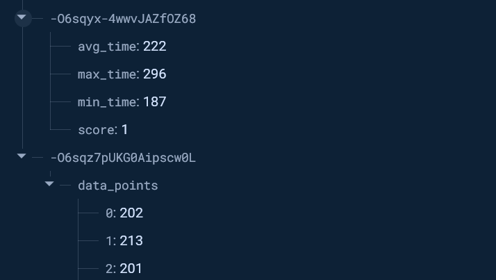

Assignment 1

1. The max_brightness value that I found was 50000 for my room, and the min_brightness value that I found was 25000 for when I covered it with my hand.

Assignment 2
1. I modified the code to play the tune of twinkle twinkle little star. I did this in the code of twinkle_sound.py under the assignments tab.

Assignment 3
1. I changed the code to do 10 iterations by changing the variable N, which controlled the loop in main, and then I used firebase realtime database as the location for me to upload my data. I added some imports to make the wifi work, as well as the writing the json file to the database. I upload both the data points themselves as well as the data of min and max response time as well the score.

